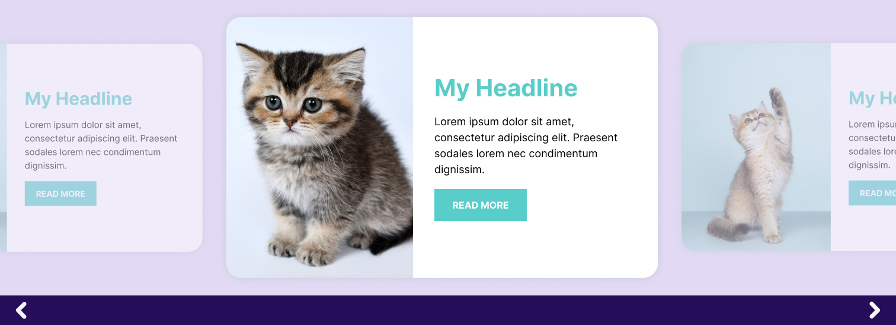

# Literati WordPress Plugin Exercise
Congratulations! We are really excited that you are interested in joining Literati Engineering and have made it to this stage. 

This WordPress exercise will help give us a working, real-world example of your code so that we can see your thought process as you work through problems on both the front-end and back-end, what tools you utilize, and how you organize your work. The basic requirements of the final deliverable are outlined below but we leave it pretty open-ended to let you decide the best method to implement and any tools or libraries required. This exercise will not be used in anything by Literati, so you can be as creative as you wish and are not concerned with Pixel Perfect representation.

## Prerequisites
In order to use/build this repo, you must have the following available:

* PHP 8.0+
* [Composer](https://getcomposer.org/download/)
* [WordPress 6.4+](https://wordpress.org/download/releases/)

## Final Deliverable
Using the boilerplate provided, create an operational plugin along with any applicable tests that does the following:

1.  Creates a new Promotion post type that includes 4 fields:
    * Header
    * Text
    * Button
    * Image

2.  Implements a Carousel Gutenberg block using the [Figma design here](https://www.figma.com/proto/cb6J47VWG0OiNHgHYrFfYJ/Literati-Example-Carousel?page-id=0%3A1&type=design&node-id=1-2&viewport=1037%2C847%2C1&t=6HoJEb2wYGRRrobI-8&scaling=scale-down&starting-point-node-id=1%3A2&device-frame=0&hotspot-hints=0&disable-default-keyboard-nav=1&hide-ui=1) (or use the .fig file in the design-files directory) with the following:
    * The block should have a field to define the transition timer (how many seconds between moving to the next item)
    * The carousel should display published Promotion content types
    * The carousel should auto transition between the attached promotions on the defined timer




## Repo Setup
This Plugin repo follows a structure similar to some of our custom plugins used on our various sites. 

```
/design-files   This contains any image references you can use in your development
/literati-example  This is the main plugin directory
  - /blocks   This contains block specific code
  - /includes This contains plugin function
  - /tests    This contains any tests
  - composer.json  Composer dependencies for the plugin
  - literati-example.php   The singleton for the plugin
  - package.json   This contains npm dependencies, including wp-scripts for building the blocks
composer.json  These are composer dependencies used outside of the plugin, such as phpunit
Makefile   Commands
phpcs.xml   Test configuration
phpunit.xml   Test Configuration
```

## Available Commands
All make commands are available from the root directory

```make install```
This will install the composer and npm dependencies

```make test```
This will run phpunit

```make build```
This will run any build tasks required for deploy

```make release```
This will build and package a zip file for the plugin that can be uploaded to a WordPress instance
